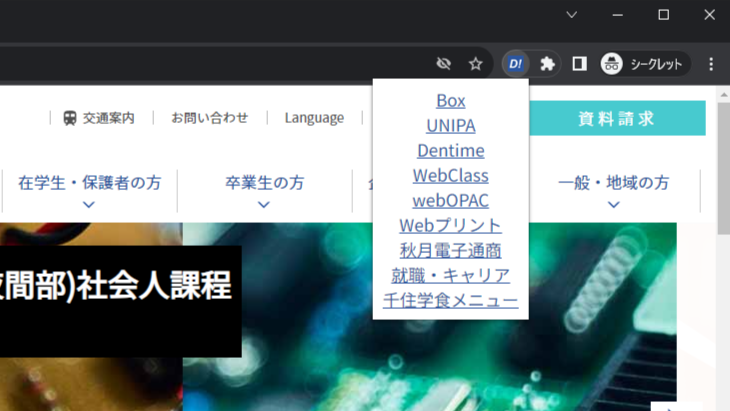

## TokyoDenki_Utilities-v0.4.1

UNIPA，Box，図書サービス，Webclassの自動ログイン等を実装しました．また，ポップアップから各ページへとアクセスしやすくしました．さらにポップアップから[Dentime](https://dentime.anozon.me)にアクセスできるようにしました．

v0.3.0からの変更点 - Webclass，UNIPAでのパスワード誤り時の動作を追加，オプションページでの誤動作を修正．
v0.4.0からの変更点 - ポップアップの修正．

### Ⅰ.機能
1. UNIPA 
    1. 自動ログイン（タイムアウト時にも一部対応）
    2. 掲示板の初期表示を未読に変更
    3. 時間割から任意の科目を非表示にすることが可能 
   

2. Box，図書サービス
    1. ログインまでの操作を省略化
3. WebClass
    1. BearOfficeさんの[WebClass-Extension](https://github.com/BearOffice/WebClass-Extension)を元に改良
        - 改良元の機能は[WebClass-Extension](https://github.com/BearOffice/WebClass-Extension)参照
    2. トップページのスタイル変更
        - 学習と振り返りの記録，ポートフォリオ，管理者からのお知らせの折りたたみ化
        - 空き時限・全休を設定することで，トップページで非表示にすることができる．
    3. 科目トップページにて各章を折り畳み可能
4. Dentime
   1. ポップアップからリンクを踏むとディスプレイ左上にポップアップウィンドウとしてDentimeを表示することが出来る．
   2. 平日・土曜と昼間部・夜間部を学籍番号から判定し，それぞれの時間割に合わせた表示機能

### Ⅱ.導入

参考 :  [カスタムの Chrome アプリと拡張機能を作成して公開する - Chrome Enterprise and Education ヘルプ](https://support.google.com/chrome/a/answer/2714278?hl=ja)

1. [TokyoDenki_Utilities](https://github.com/Kokim-electronics/TokyoDenki_Utilities/releases)から`Assets - TokyoDenki_Utilities-vx.x.x.zip`をDL
2. 解凍し`TokyoDenki_Utilities`フォルダを`Users/Document`などに移動する
3. `chrome://extensions/`，`edge://extensions/`へアクセス、デベロッパーモード(Chrome)オン
4. `TokyoDenki_Utilities`フォルダ(manifest.jsonが入っているフォルダ以外はエラーを吐きます)をD&D
5. 設定画面にて学籍番号と共通パスワードを設定
6. 注意事項：学籍番号やパスワードを間違えるとUNIPAがアカウントの一時ロックが起こります．
7. ブラウザ右上の拡張機能アイコンから本拡張機能をピン止め
   
   

### Ⅲ.参考資料
BearOffice/WebClass-Extension: ウェブクラス(WebClass)の利便性を向上できるChrome拡張機能． https://github.com/BearOffice/WebClass-Extension 
a01sa01to/WebClass-PreventDL:埼玉大学生向けChrome拡張機能． https://github.com/a01sa01to/WebClass-PreventDL

最終更新日:2023/05/26 14:15
